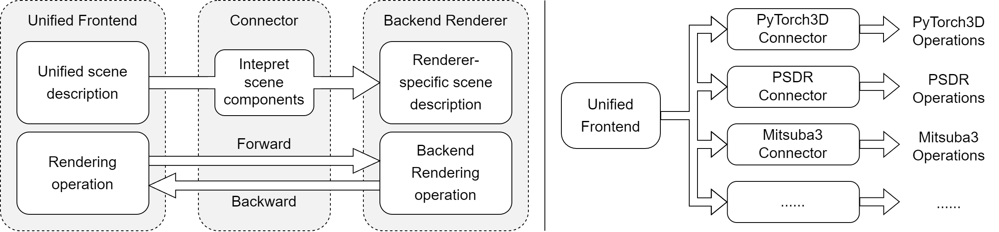

# irtk: Inverse Rendering Toolkit

[](https://badge.fury.io/py/irtk)

`irtk` (**I**nverse **R**endering **T**ool**k**it) is designed to simplify the process of conducting inverse rendering experiments with differentiable renderers. 

:::{note} 
:class: dropdown
For more information on differentiable rendering and inverse rendering, refer to [CVPR 2021 Tutorial on Physics-Based Differentiable Rendering](https://diff-render.org/tutorials/cvpr2021/)
:::

Currently, a variety of differentiable renderers are available, including [`psdr-jit`](https://github.com/andyyankai/psdr-jit), [`Mitsuba 3`](https://github.com/mitsuba-renderer/mitsuba3), and [`PyTorch3D`](https://pytorch3d.org/). However, the different interfaces of these renderers often pose challenges when attempting to compare or convert between them.

To address this issue, `irtk` introduces a unified frontend built on [`PyTorch`](https://pytorch.org/), along with a set of connectors that facilitate seamless communication with various differentiable renderers. It enables users to render scenes and compute gradients with respect to scene elements across different renderers with minimal code modifications. By abstracting away the complexities of individual renderer interfaces, `irtk` empowers researchers and developers to focus on their inverse rendering algorithms.



```{toctree}
:caption: Get Started
:maxdepth: 3
:hidden:

install
examples/quick_start
```

```{toctree}
:caption: Tutorials
:maxdepth: 2
:hidden:

examples/simple_inverse_rendering_example
```

```{toctree}
:caption: References
:maxdepth: 2
:hidden:

connectors/index
api
```